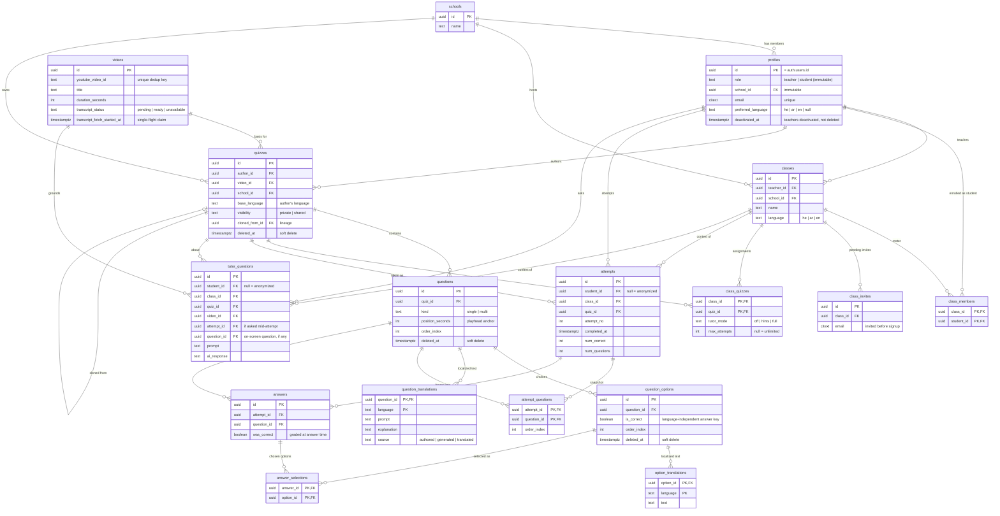

# Data model

OrtTube stores everything in Postgres (Supabase). Identity, content, delivery, and
results are normalized into the tables below. All writes go through
`SECURITY DEFINER` RPCs and Row-Level Security; application code never mutates
these tables directly except where a table is explicitly RLS-writable.

## Entity-relationship diagram

## Tables by area

### Identity

- **`schools`** — the tenant boundary. Every profile, class, and quiz belongs to
  exactly one school; cross-school access is denied everywhere.
- **`profiles`** — one row per user, keyed to `auth.users`. `role`
  (`teacher`/`student`) and `school_id` are **immutable** after creation
  (enforced by trigger + column-level REVOKE). `preferred_language` is optional
  and drives language resolution. Teachers are **deactivated** (`deactivated_at`),
  never hard-deleted while they own content.

### Classes, membership, invites

- **`classes`** — owned by a teacher, scoped to the teacher's school, with a
  content `language`. Composite foreign keys guarantee the owner is a `teacher`
  and lives in the same `school` as the class.
- **`class_members`** — the roster. Composite FK guarantees each member is a
  `student`.
- **`class_invites`** — a pending invite by email for a student who hasn't signed
  up yet. When that email registers, an `AFTER INSERT` trigger converts matching
  invites into memberships.

### Videos (canonical, shared, ownerless)

- **`videos`** — one row per YouTube video, deduped by `youtube_video_id` and
  shared across all quizzes/schools. No owner column. `transcript_status` +
  `transcript_fetch_started_at` implement single-flight transcript fetching so
  concurrent authors don't fetch the same transcript twice. Orphan videos (no
  referencing quiz) are garbage-collected after a grace window.

### Quizzes, questions, options, translations

- **`quizzes`** — authored on a video, in the author's `base_language`, `private`
  by default or `shared` to the same-school catalog. `cloned_from_id` records
  clone lineage. Soft-deleted via `deleted_at`.
- **`questions`** — anchored to a playhead `position_seconds`; `single` or `multi`
  choice. Soft-deleted.
- **`question_options`** — the choices. **`is_correct` is the language-independent
  answer key** — correctness lives here, not in any translated text, so it can
  never desync across languages. Soft-deleted to preserve answer history.
- **`question_translations` / `option_translations`** — per-language prompt /
  explanation / option text. The base language is written at authoring; other
  languages are filled lazily by AI translation. Translating never touches
  `is_correct`, `position_seconds`, or option identity.

### Assignment, attempts, answers

- **`class_quizzes`** — assigns a quiz to a class with per-assignment delivery
  settings: `tutor_mode` (`off`/`hints`/`full`) and `max_attempts`
  (`null` = unlimited).
- **`attempts`** — one row per student run of an assigned quiz. `student_id` goes
  `NULL` when a student is anonymized (right-to-be-forgotten), and such rows still
  count toward class statistics.
- **`attempt_questions`** — the frozen question set captured when an attempt
  starts, so later edits to the quiz don't change what that attempt was scored
  against.
- **`answers` / `answer_selections`** — one `answers` row per answered question
  with `was_correct` graded at answer time, plus the exact options chosen.

### AI tutor

- **`tutor_questions`** — a log of every tutor interaction (prompt + AI response)
  with its class/quiz/video context and, when applicable, the active attempt and
  on-screen question. Powers tutor analytics; anonymized with the student.

## Key invariants

- **Answer key is structural and language-independent.** Correctness is
  `question_options.is_correct`; translations carry only display text. A quiz can
  be shown in `he`/`ar`/`en` with a single source of truth for what's right.
- **Language resolution precedence:** `profiles.preferred_language` →
  `classes.language` → `quizzes.base_language`. The base language is `NOT NULL`,
  so resolution always terminates in a valid language.
- **Reveal gate.** Per-question correctness, correct options, and explanations are
  returned to a student **only when no retake remains** (the attempt is completed
  and the attempt cap is exhausted). While attempts are left, only the aggregate
  score is returned; unlimited attempts never reveal per-question detail. Students
  have no direct read grant on `answers` / `answer_selections`.
- **Tenant isolation.** School membership is checked on every cross-entity action;
  composite FKs make it impossible to own a class in another school or enroll a
  teacher as a student.
- **Immutability.** A profile's `role` and `school_id` cannot change after
  creation; a deactivated teacher cannot clear their own `deactivated_at`.
- **Soft delete then purge.** Quizzes and their content are soft-deleted
  (`deleted_at`) so in-flight results stay consistent, then hard-deleted at quiz
  granularity by a retention job whose cascade removes questions, options,
  translations, assignments, attempts, answers, and tutor logs.
