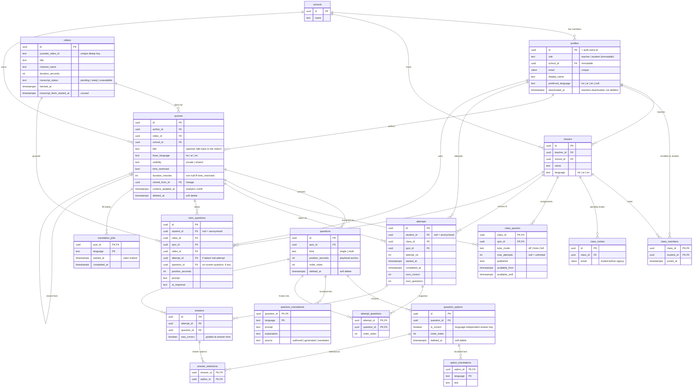

# Data model

Everything lives in Postgres (Supabase). All writes go through `SECURITY DEFINER`
RPCs; Row-Level Security, grants, triggers and composite foreign keys enforce the
invariants below regardless of caller.

## Entity-relationship diagram

```mermaid
erDiagram
    schools ||--o{ profiles : "has members"
    schools ||--o{ classes : "hosts"
    schools ||--o{ quizzes : "owns"

    profiles ||--o{ classes : "teaches"
    profiles ||--o{ class_members : "enrolled as student"
    profiles ||--o{ quizzes : "authors"
    profiles ||--o{ attempts : "attempts"
    profiles ||--o{ tutor_questions : "asks"

    classes ||--o{ class_members : "roster"
    classes ||--o{ class_invites : "pending invites"
    classes ||--o{ class_quizzes : "assignments"
    classes ||--o{ attempts : "context of"
    classes ||--o{ tutor_questions : "context of"

    videos ||--o{ quizzes : "basis for"
    videos ||--o{ tutor_questions : "grounds"

    quizzes ||--o{ questions : "contains"
    quizzes ||--o{ class_quizzes : "assigned via"
    quizzes ||--o{ attempts : "taken as"
    quizzes ||--o{ tutor_questions : "about"
    quizzes ||--o{ translation_jobs : "fill claims"
    quizzes ||--o| quizzes : "cloned from"

    questions ||--o{ question_options : "choices"
    questions ||--o{ question_translations : "localized text"
    questions ||--o{ attempt_questions : "frozen into"
    questions ||--o{ answers : "answered as"

    question_options ||--o{ option_translations : "localized text"
    question_options ||--o{ answer_selections : "selected as"

    attempts ||--o{ attempt_questions : "snapshot"
    attempts ||--o{ answers : "records"
    answers ||--o{ answer_selections : "chosen options"

    schools {
        uuid id PK
        text name
    }
    profiles {
        uuid id PK "= auth.users.id"
        text role "teacher | student (immutable)"
        uuid school_id FK "immutable"
        citext email "unique"
        text display_name
        text preferred_language "he | ar | en | null"
        timestamptz deactivated_at "teachers deactivated, not deleted"
    }
    classes {
        uuid id PK
        uuid teacher_id FK
        uuid school_id FK
        text name
        text language "he | ar | en"
    }
    class_members {
        uuid class_id PK, FK
        uuid student_id PK, FK
        timestamptz joined_at
    }
    class_invites {
        uuid id PK
        uuid class_id FK
        citext email "invited before signup"
    }
    videos {
        uuid id PK
        text youtube_video_id "unique dedup key"
        text title
        text channel_name
        int duration_seconds
        text transcript_status "pending | ready | unavailable"
        timestamptz fetched_at
        timestamptz transcript_fetch_started_at "unused"
    }
    quizzes {
        uuid id PK
        uuid author_id FK
        uuid video_id FK
        uuid school_id FK
        text title "optional; falls back to the video's"
        text base_language "he | ar | en"
        text visibility "private | shared"
        bool time_restricted
        int duration_minutes "non-null iff time_restricted"
        uuid cloned_from_id FK "lineage"
        timestamptz content_updated_at "analytics cutoff"
        timestamptz deleted_at "soft delete"
    }
    questions {
        uuid id PK
        uuid quiz_id FK
        text kind "single | multi"
        int position_seconds "playhead anchor"
        int order_index
        timestamptz deleted_at "soft delete"
    }
    question_options {
        uuid id PK
        uuid question_id FK
        boolean is_correct "language-independent answer key"
        int order_index
        timestamptz deleted_at "soft delete"
    }
    question_translations {
        uuid question_id PK, FK
        text language PK
        text prompt
        text explanation
        text source "authored | generated | translated"
    }
    option_translations {
        uuid option_id PK, FK
        text language PK
        text text
    }
    translation_jobs {
        uuid quiz_id PK, FK
        text language PK
        timestamptz started_at "claim marker"
        timestamptz completed_at
    }
    class_quizzes {
        uuid class_id PK, FK
        uuid quiz_id PK, FK
        text tutor_mode "off | hints | full"
        int max_attempts "null = unlimited"
        bool published
        timestamptz available_from
        timestamptz available_until
    }
    attempts {
        uuid id PK
        uuid student_id FK "null = anonymized"
        uuid class_id FK
        uuid quiz_id FK
        int attempt_no
        timestamptz started_at
        timestamptz completed_at
        int num_correct
        int num_questions
    }
    attempt_questions {
        uuid attempt_id PK, FK
        uuid question_id PK, FK
        int order_index
    }
    answers {
        uuid id PK
        uuid attempt_id FK
        uuid question_id FK
        boolean was_correct "graded at answer time"
    }
    answer_selections {
        uuid answer_id PK, FK
        uuid option_id PK, FK
    }
    tutor_questions {
        uuid id PK
        uuid student_id FK "null = anonymized"
        uuid class_id FK
        uuid quiz_id FK
        uuid video_id FK
        uuid attempt_id FK "if asked mid-attempt"
        uuid question_id FK "on-screen question, if any"
        int position_seconds
        text prompt
        text ai_response
    }
```

Every table also has `created_at`. Three ungranted views, `analytics_attempts`,
`analytics_answers` and `analytics_tutor_questions`, filter the underlying tables
to attempts started after the quiz's `content_updated_at`; all teacher analytics
read through them.

## Tables by area

- **Identity.** `schools` is the tenant boundary. `profiles` maps to
  `auth.users`; `role` and `school_id` never change. Teachers are deactivated,
  not deleted.
- **Classes.** `classes` belong to a teacher and carry a content language.
  `class_members` is the roster. `class_invites` holds emails invited before
  signup; a trigger converts them to memberships when the student registers.
- **Videos.** One row per YouTube id, shared across quizzes and schools, no
  owner. Transcript status and freshness live here; the transcript itself is in
  Storage. Orphans are garbage-collected.
- **Quizzes.** Authored on a video in a base language, private or shared to the
  school, soft-deleted. `questions` are anchored to a playhead position;
  `question_options` hold the answer key; the translation tables hold per-language
  text. `translation_jobs` is a per-(quiz, language) claim so concurrent fills
  run once.
- **Assignment.** `class_quizzes` carries the delivery settings for one quiz in
  one class: tutor mode, attempt cap, publish state, availability window.
- **Attempts.** One `attempts` row per student run. `attempt_questions` freezes
  the question set at start. `answers` are graded at answer time;
  `answer_selections` record the chosen options.
- **Tutor.** `tutor_questions` logs every exchange with its context.

## Key invariants

- **Answer key is structural.** Correctness is `question_options.is_correct`;
  translations carry only text. A trigger requires exactly one correct option for
  `single` and at least one for `multi`.
- **Language resolution:** `profiles.preferred_language` → `classes.language` →
  `quizzes.base_language`.
- **Reveal gate.** Per-question detail is returned to a student only when no
  retake remains (cap exhausted or window closed). Students have no direct read
  on `question_options`, `answers` or `answer_selections`.
- **Allocation liveness.** An unpublished or out-of-window assignment is invisible
  to students in every read that acts on it. A window closing mid-attempt
  finalizes the attempt at the closing time.
- **Analytics cutoff.** Content edits stamp `quizzes.content_updated_at`; reports
  count only attempts started after it. Rows are never deleted. Unchanged
  resends and non-base-language translations do not bump the stamp.
- **Tenant isolation.** Composite foreign keys make cross-school ownership and
  wrong-role membership unrepresentable.
- **Soft delete, then purge.** Quiz content is soft-deleted; a retention job
  hard-deletes whole quizzes later. Deleting a student nulls their id on
  attempts and tutor logs, which still count.
